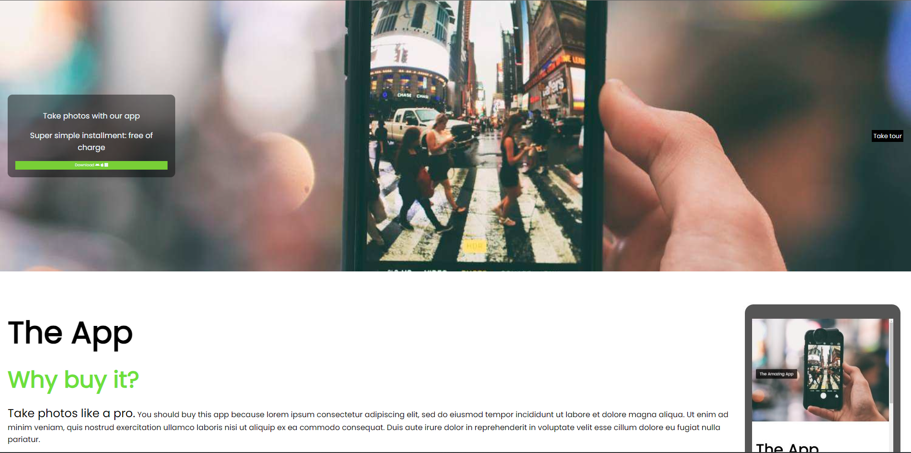
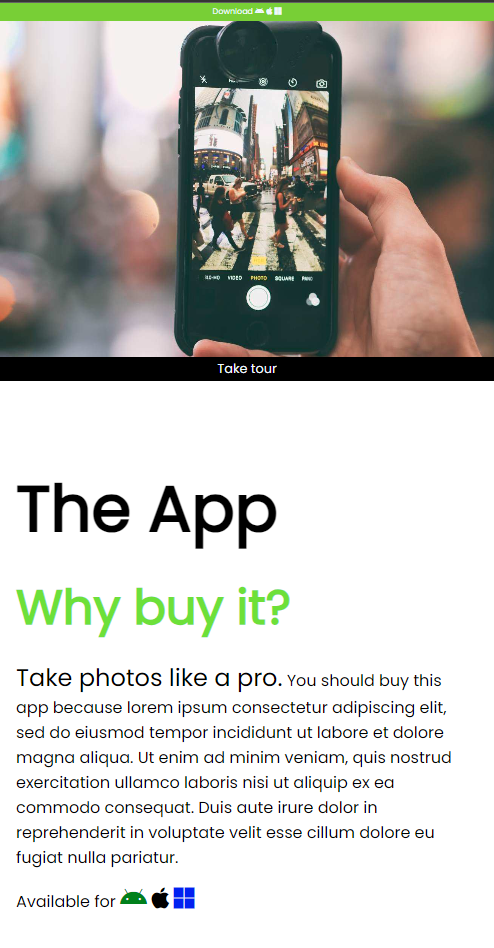

# Project Title

A brief description of what this project does and who it's for

- first item
- seconde item

```echo hello world```
## Screenshots


## Deployment

To deploy this project run

```bash
  npm run deploy
```

```node index.js```
## Documentation

[mon app2](https://github.com/AlexNeige/app2)

## Features

- Light/dark mode toggle
- Live previews
- Fullscreen mode
- Cross platform


## Roadmap

- Additional browser support

- Add more integrations


## License

[MIT](https://choosealicense.com/licenses/mit/)

#Screenshot




